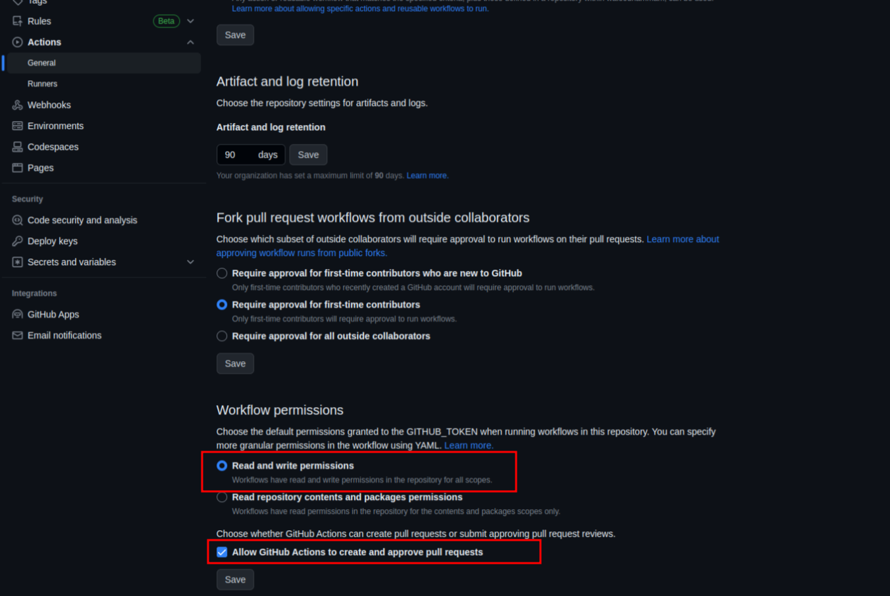
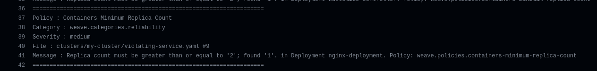
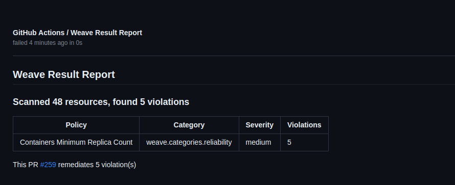
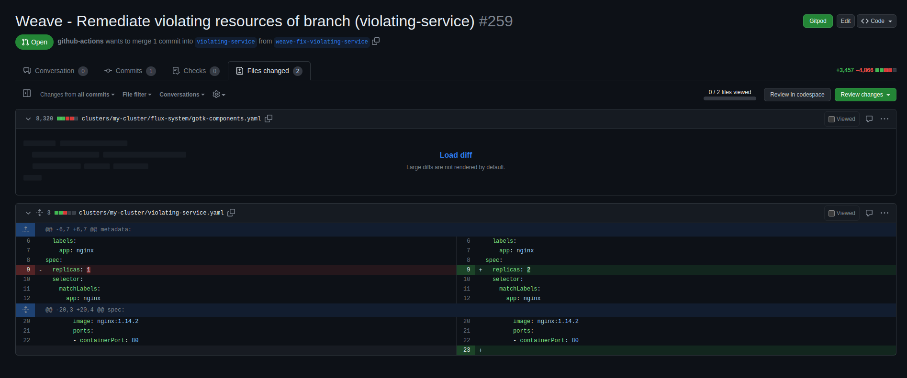
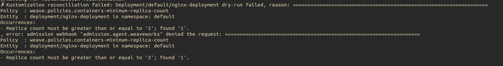

# End to end demo

## Prerequisites

- Kubernetes Cluster (>= v1.20)
- [Flux](https://fluxcd.io/flux/installation/) (>= v0.36.0)
- [kubectl](https://kubernetes.io/docs/tasks/tools/#kubectl)
- [Policy Agent](https://github.com/weaveworks/policy-agent/blob/dev/docs/getting-started.md)
- [Weave Policy Validator](https://github.com/weaveworks/weave-policy-validator/blob/main/README.md)
- Violating Deployment


## Configurations

Install the [Policy Agent](https://github.com/weaveworks/policy-agent/blob/dev/docs/getting-started.md) and make sure to install the policies in your cluster.

Copy the [policies](https://github.com/weaveworks/policy-agent/tree/master/policies) to the root of the repository to be used by the commit time validation.

Copy the Weave Policy Validator [Github Action](./weave-policy-validator-gh-action.yml) to your repository under the workflows ex: `.github/workflows/weave-policy-validator-gh-action.yml`

<details>
  <summary>weave-policy-validator-gh-action.yml - Click to expand .. </summary>

```yaml
name: Weaveworks Policy Validator
on:
  pull_request:
    branches: [ main, dev ]
jobs:
  main:
    runs-on: ubuntu-latest
    steps:
      - uses: actions/checkout@v3
      - uses: weaveworks/weave-action@v1
        with:
          path: ./                    # entites to scan
          policies-path: ./policies   # policies path
          remediate: true             # enable auto remediation

```
</details>

Allow creating PRs permission for Github actions from the repository settings.

  

The repository structure should be something like the one below:

  ```bash
    .
    ├── .github
    │   └── workflows
    │       └── weave-policy-validator-gh-action.yml
    ├── clusters
    │   ├── bases
    │   │   ├── networkpolicy
    │   │   │   └── flux-system-networkpolicy.yaml
    │   │   └── rbac
    │   │       └── wego-admin.yaml
    │   └── my-cluster
    │       ├── flux-system
    │       │   ├── gotk-components.yaml
    │       │   ├── gotk-sync.yaml
    │       │   └── kustomization.yaml
    │       ├── policies.yaml
    │       ├── wpa-helmrelease.yaml
    │       └── wpa-helmrepo.yaml
    └── policies
        ├── ControllerContainerAllowingPrivilegeEscalation.yaml
        ├── ControllerContainerBlockSysctls.yaml
        ├── ControllerContainerRunningAsRoot.yaml
        ├── ControllerMinimumReplicaCount.yaml
        ├── ControllerReadOnlyFileSystem.yaml
        └── kustomization.yaml

  ```

## Flow

### Commit time validation

This will validate the repository entites in the commit time by using the CI.

Create new branch from the repository and add the Violating Deployment
to this path `clusters/my-cluster/violating-deployment.yaml` then create a pull request with this branch against `main`.

<details>
  <summary>violating-deployment.yaml - Click to expand .. </summary>

```yaml
apiVersion: apps/v1
kind: Deployment
metadata:
  name: nginx-deployment
  namespace: default
  labels:
    app: nginx
spec:
  replicas: 1
  selector:
    matchLabels:
      app: nginx
  template:
    metadata:
      labels:
        app: nginx
    spec:
      containers:
      - name: nginx
        image: nginx:1.14.2
        ports:
        - containerPort: 80

```
</details>


Once the PR is created the Weave Policy Validator Github Action will start checking for violations and attempt to fix it.
  
  

A report will be generated to make it easy to view the violations.

  

Also a remediation pull request will created to fix the violations that will require the user review.

  


### Policy Agent validation

If a file sneaked somehow into the repository to the cluster, then the Policy Agent's admission controller will stop it.

Go ahead and push the file `clusters/my-cluster/violating-deployment.yaml` directly into `main` to skip the CI checks.

The Policy Agent's admission controller will reject the creation of the deployment causing the Flux reconciliation to fail with the following error and the violating deployment will not be applied to the cluster.

  


## Tear down

Remove the violating deployment from the repository.

Remove the policies directory and the workflow directory from the repository.

Remove the policy agent files (HelmRepository, HelmRelease, Policies) from the repository.

Wait/Trigger flux reconcillation.
